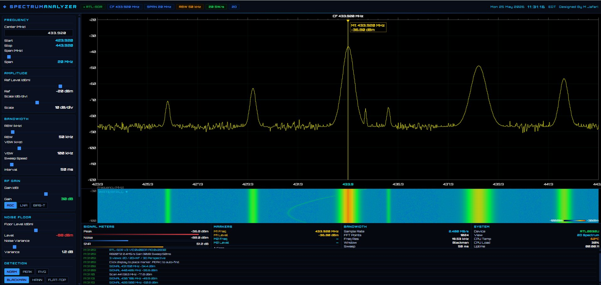

<div align="center">

# ◈ RPi4 Spectrum Analyzer

### Real-Time RF Spectrum Analyzer — RTL-SDR Blog V3 + Raspberry Pi 4
#### Designed By M Jafari

[](LICENSE)
[](https://www.python.org/)
[](https://www.rtl-sdr.com/)
[](https://www.raspberrypi.com/)

</div>

---

## 📡 Dashboard Preview



*Live spectrum at 433.920 MHz ISM band — yellow trace, waterfall, dual markers, signal log*

---

## ✨ Features

| Feature | Details |
|---------|---------|
| **2D Spectrum** | Yellow trace on black background, 10×10 grid |
| **3D Perspective Waterfall** | Isometric stacked trace history |
| **Flat Waterfall** | Always-visible scrolling history below spectrum |
| **Dual Markers** | M1 (yellow) + M2 (cyan), manual frequency entry, Δ freq/level |
| **Span Zoom** | 100 kHz – 500 MHz, centered on CF |
| **Noise Floor Control** | Adjustable level and variance sliders |
| **Detection Modes** | Normal, Peak Hold, Average |
| **Frequency Presets** | 433/868/900 ISM, FM, NOAA, PMR446 |
| **Signal Logger** | Live event log with timestamps |
| **Auto-Start** | Systemd service, starts on every boot |
| **Orbitron Font** | Full sci-fi SDR aesthetic |

---

## 🛠 Hardware Requirements

### Essential
| Item | Spec | Price |
|------|------|-------|
| Raspberry Pi 4 Model B | 4GB RAM recommended 
| RTL-SDR Blog V3 | RTL2832U + R820T2, 1PPM TCXO, SMA
| SMA Antenna | RTL-SDR Blog dipole kit recommended 
| MicroSD Card | 32GB+ Class 10 (Samsung/SanDisk) 
| USB-C Power Supply | 5V / 3A (official RPi PSU) 

### Recommended Accessories
| Item | Benefit |
|------|---------|
| Nooelec LaNA LNA | +10–15 dB sensitivity improvement |
| RPi Case with Fan | Prevents thermal throttling |
| SMA Extension (30cm) | Reduces USB 3.0 noise interference |
| 433/900 MHz SAW Filter | Cleaner band-specific monitoring |

---

## ⚡ Quick Install — 3 Commands

```bash
# 1. Copy project to your Pi (run on your computer)
scp -r . pi@raspberrypi.local:/home/pi/spectrum_analyzer_project/

# 2. SSH into your Pi
ssh pi@raspberrypi.local

# 3. Run the installer
cd /home/pi/spectrum_analyzer_project && bash install.sh
```

Then open your browser at: **http://raspberrypi.local:5000**

---

## 📋 Step-by-Step Installation

### Phase 1 — Flash Raspberry Pi OS

1. Download [Raspberry Pi Imager](https://www.raspberrypi.com/software/)
2. Flash **Raspberry Pi OS Lite (64-bit)** to your microSD
3. In Advanced Options (⚙ gear icon):
   - Enable SSH
   - Set username: `pi` and password
   - Configure WiFi with your SSID + password
   - Set your timezone/locale
4. Insert SD card into Pi and power on
5. Wait 60–90 seconds for first boot

### Phase 2 — Connect to the Pi

```bash
# From your computer
ssh pi@raspberrypi.local

# Update system first
sudo apt update && sudo apt upgrade -y
sudo reboot
```

### Phase 3 — Clone this Repository

```bash
ssh pi@raspberrypi.local

# Install git
sudo apt install -y git

# Clone the repository
git clone https://github.com/AFGHANOO/Spectrum-analyzer-rpi.git
cd Spectrum-analyzer-rpi
```

### Phase 4 — Run the Installer

```bash
bash install.sh
```

The installer automatically:
- ✅ Updates system packages
- ✅ Installs RTL-SDR system libraries
- ✅ Blacklists conflicting DVB kernel driver
- ✅ Configures USB device permissions
- ✅ Installs Python packages
- ✅ Copies files to `/home/pi/spectrum_analyzer/`
- ✅ Installs + enables systemd auto-start service

### Phase 5 — Connect RTL-SDR and Test

```bash
# Plug in your RTL-SDR Blog V3 dongle, then:
rtl_test -t
```

Expected output:
```
Found 1 device(s):
  0:  Realtek, RTL2838UHIDIR, SN: 00000001
Found Rafael Micro R820T tuner
```

### Phase 6 — Open the Dashboard

On any device on your WiFi network, open a browser:

```
http://raspberrypi.local:5000
```

---

## 📁 Project Structure

```
Spectrum-analyzer-rpi/
├── spectrum_analyzer.html      ← Full dashboard (HTML/CSS/JS)
├── backend.py                  ← Python WebSocket server + RTL-SDR
├── install.sh                  ← One-command full installer
├── start.sh                    ← Manual start script
├── requirements.txt            ← Python dependencies
├── spectrum-analyzer.service   ← Systemd auto-start service
├── SETUP_GUIDE.md              ← Full step-by-step guide
├── screenshot.png              ← Dashboard preview
└── README.md                   ← This file
```

---

## 🎛 Dashboard Controls

### Frequency
- **Center Frequency** — type MHz value, press Enter (0.5–900 MHz)
- **Span** — 100 kHz to 500 MHz, zooms symmetrically around CF
- **Presets** — one-click jump to common bands

### Markers
- **Left-click** spectrum → place M1 (yellow)
- **Right-click** spectrum → place M2 (cyan)
- Type any frequency in M1/M2 field + Enter to jump there
- **PEAK↑** auto-finds strongest signal
- **Δ display** shows freq and level difference between markers

### View Modes
- **2D Spectrum** — classic yellow trace display
- **3D Perspective** — isometric waterfall history

---

## 🔧 Service Management

```bash
sudo systemctl status  spectrum-analyzer   # check status
sudo systemctl start   spectrum-analyzer   # start
sudo systemctl stop    spectrum-analyzer   # stop
sudo systemctl restart spectrum-analyzer   # restart
journalctl -u spectrum-analyzer -f         # live logs
```

---

## 🔍 Troubleshooting

**RTL-SDR not detected:**
```bash
sudo modprobe -r dvb_usb_rtl28xxu
rtl_test -t
```

**Dashboard shows DEMO mode:**
```bash
journalctl -u spectrum-analyzer -f   # check for errors
```

**Frequency slightly off:**
```bash
rtl_test -p   # wait 10 min, note PPM value
# Edit backend.py: sdr.freq_correction = YOUR_PPM
```

**Can't reach raspberrypi.local:**
```bash
hostname -I   # get IP address, use http://IP:5000
```

---

## 📦 Python Dependencies

```
pyrtlsdr >= 0.2.92
numpy >= 1.21.0
flask >= 2.3.0
flask-socketio >= 5.3.0
flask-cors >= 4.0.0
eventlet >= 0.33.0
```

---

## 📄 License

MIT License — free to use, modify, and distribute.

---

## 👨‍💻 Author

**Designed By M Jafari**

RTL-SDR Blog V3 + Raspberry Pi 4 Spectrum Analyzer Project

---

<div align="center">
<i>Built with ❤️ for the SDR community</i>
</div>
